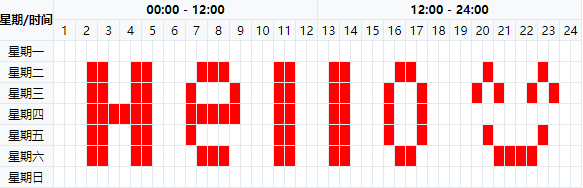
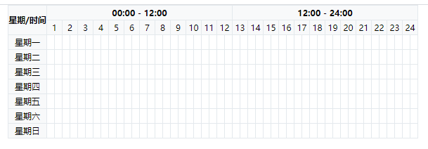
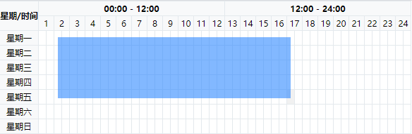
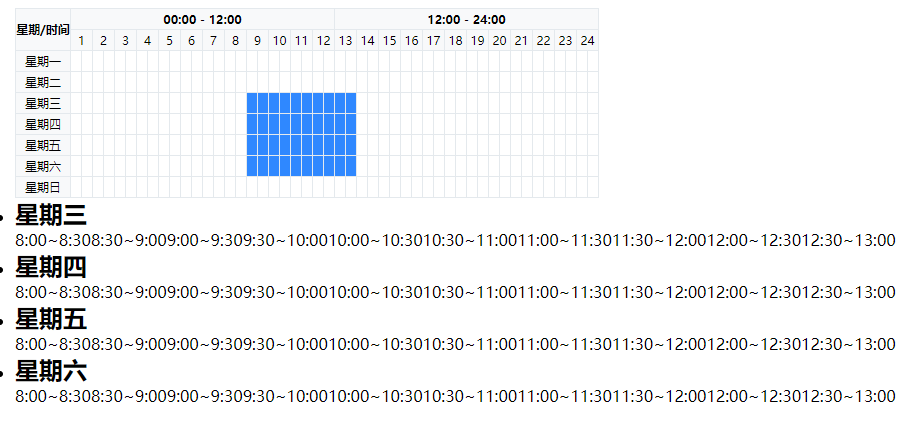

# 我学会了框选选择器



在项目中自己实现了一下这个小功能，在这里给大家记录分享一下它的实现原理。 希望大家做类似业务可以带来些灵感。

## 先画个表格



我们先看下代码

```vue
<template>
  <div class="calendar">
    <table class="calendar-table">
      <thead class="calendar-head">
        <tr>
          <th rowspan="8" class="week-td">星期/时间</th>
          <th colspan="24">00:00 - 12:00</th>
          <th colspan="24">12:00 - 24:00</th>
        </tr>
        <tr>
          <td colspan="2" v-for="i in 24" :key="i">{{i}}</td>
        </tr>
      </thead>
      <tbody
        class="calendar-body"
      >
        <tr>
          <td>星期一</td>
          <td
            class="calendar-time"
            @click="itemClick"
            v-for="i in 48"
            :key="('1,'+i)"
            :data-id="('1,'+i)"
          ></td>
        </tr>
        <tr>
          <td>星期二</td>
          <td
            class="calendar-time"
            @click="itemClick"
            v-for="i in 48"
            :key="('2,'+i)"
            :data-id="('2,'+i)"
          ></td>
        </tr>
        <tr>
          <td>星期三</td>

          <td
            class="calendar-time"
            @click="itemClick"
            v-for="i in 48"
            :key="('3,'+i)"
            :data-id="('3,'+i)"
          ></td>
        </tr>
        <tr>
          <td>星期四</td>
          <td
            class="calendar-time"
            @click="itemClick"
            v-for="i in 48"
            :key="('4,'+i)"
            :data-id="('4,'+i)"
          ></td>
        </tr>
        <tr>
          <td>星期五</td>
          <td
            class="calendar-time"
            @click="itemClick"
            v-for="i in 48"
            :key="('5,'+i)"
            :data-id="('5,'+i)"
          ></td>
        </tr>
        <tr>
          <td>星期六</td>
          <td
            class="calendar-time"
            @click="itemClick"
            v-for="i in 48"
            :key="('6,'+i)"
            :data-id="('6,'+i)"
          ></td>
        </tr>
        <tr>
          <td>星期日</td>
          <td
            class="calendar-time"
            @click="itemClick"
            v-for="i in 48"
            :key="('7,'+i)"
            :data-id="('7,'+i)"
          ></td>
        </tr>
      </tbody>
    </table>
      <ul>
       <li v-for="(item, index) in viewDateArr" :key="index">
         <h2>
           {{
           item.title
           }}
         </h2>
         <p>
           <span v-for="(it, index) in item.arr" :key="index">{{item.arr[index+1]}}</span>
         </p>
       </li>
     </ul>
  </div>
</template>
<script>
import { screen, setItemDate } from '../utils'
export default {
  name: "calendar-table",
  data() {
    return {
      dateTime: [],
      viewDateArr: [],
      oldArr: [],
    };
  },
  methods: {
    //点击事件
    itemClick(e) {
      e.preventDefault();
      let dom = e.target;
      //获取class
      let classListData = Array.from(e.target.classList);
      let timeId = dom.getAttribute("data-id");
      if (classListData.includes("bg")) {
        //选择取消高亮
        dom.classList.remove("bg");
        this.dateTime = this.dateTime.filter(e => {
          return e !== timeId;
        });
      } else {
        //添加高亮
        dom.classList.add("bg");
        this.dateTime.push(timeId);
      }
    }
  }
};
</script>

<style lang="stylus" scoped>
*, :after, :before {
  box-sizing: border-box;
  margin: 0;
  padding: 0;
}
table {
  border-spacing: 0;
}
.calendar {
  background-color: #fff;
  position: relative;
  display: inline-block;
  .schedule {
    position: fixed;
    width: 0;
    height: 0;
    top: 0;
    left: 0;
    display: block;
    background: #2F88FF;
    pointer-events: none;
  }
  .calendar-table {
    border-collapse: collapse;
    border-radius: 4px;
    tr, td, th {
      border: 1px solid #E4E9ED;
      font-size: 12px;
      text-align: center;
      min-width: 11px;
      height: 21px;
    }
    thead {
      th, td {
        background: #F8F9FA;
      }
    }
    .calendar-body {
      tr {
        td {
          border: 1px solid #E4E9ED;

          &:hover {
            background-color: #f1f1f1;
          }

          &.selected {
            background-color: #2F88FF;
          }
        }

        & > td:first-child {
          background-color: #F8F9FA;
        }
      }
    }
  }
}

td::selection {
  background: rgba(0, 0, 0, 0);
}

th::selection {
  background: rgba(0, 0, 0, 0);
}
.bg {
  background: #2f88ff;
}
</style>

```

如上代码我们完成了第一步 ，画图 和点击选中 这里不多做赘述 像相信每一位同学东可以轻松搞定 

## 先实现一个遮罩选中一个范围



我们先在html中放一个空的div 然后监听滑动事件 动态的计算div的位置以及宽高

```vue
<template>

  <div class="calendar">
    <div
      ref="Tbody"
      class="schedule"
      :style="scheduleStyle"
    ></div>

    <table class="calendar-table">
      <thead class="calendar-head">
        // ...
      </thead>
      <tbody
        class="calendar-body"
        @mousemove="onMousemove"
        @mousedown="onMousedown"
        @mouseup="onMouseup"
      >
        // ...
      </tbody>
    </table>

  </div>
</template>
<script>
import { screen, setItemDate } from '../utils'
export default {
  name: "calendar-table",
  data() {
    return {
      left: 0,// 
      top: 0,
      clientX: 0,
      clientY: 0,
      scheduleStyle: {},
    };
  },
  methods: {
    onMousemove(e) {
      e.preventDefault();
      const { clientX, clientY } = e;
      if (this.isMousedown) { //
        let left = this.left,
        top = this.top,
        width = 0,
        height = 0;
        //判断滑动方向
        width = clientX - this.clientX;
        height = clientY - this.clientY;
        //x轴向左
        if (clientX < this.clientX) {
          width = this.clientX - clientX;
          left = this.left - width;
        }
        if (clientY < this.clientY) {
          height = this.clientY - clientY;
          top = this.top - height;
        }
        this.scheduleStyle = {
          width: `${width}px`,
          height: `${height}px`,
          display: "block",
          opacity: 0.6,
          left: `${left}px`,
          top: `${top}px`
        };
      }
    },
    // 鼠标按下事件
    onMousedown(e) {
      e.preventDefault();
      this.isMousedown = true;
      const { clientX, clientY } = e;
      this.left = e.pageX;
      this.top = e.pageY;
      this.clientX = clientX;
      this.clientY = clientY;
      //判断滑动方向
      this.scheduleStyle = {
        width: `0px`,
        height: `0px`,
        display: "block",
        opacity: 0.6,
        left: `${clientX}px`,
        top: `${clientY}px`
      };
    },
    onMouseup(){
       this.scheduleStyle = {
        width: `0px`,
        height: `0px`,
        display: "none",
        opacity: 0
      };
    }
  }
};
</script>
```
以上代码监听了利用了三个事件来完成框选所需要的遮罩层

- 按下事件：按下时记录点击时`clientX` `clientY` `pageX` `pageY`坐标点位置

        `e.clientX` 是目标点距离浏览器可视范围的X轴坐标

        `e.clientY` 是目标点距离浏览器可视范围的Y轴坐标

        `e.pageX` 是目标点距离document最左上角的X轴坐标

        `e.pageY` 是目标点距离document最左上角的Y轴坐标

- 滑动事件：滑动时候 同样获取`clientX` `clientY` `pageX` `pageY`坐标点位置 然后与之前点击时记录位置对比 从儿计算出遮罩需要出现的位置 及高度

- 抬起事件：鼠标抬起消除状态隐藏 遮罩

## 计算是否被选中
因为只有在抬起时才会记录之前所有状态 所以我们选在这里进行计算

这里用到了`getBoundingClientRect`这个方法
> getBoundingClientRect用于获得页面中某个元素的左，上，右和下分别相对浏览器视窗的位置。getBoundingClientRect是DOM元素到浏览器可视范围的距离（不包含文档卷起的部分）。
如下

计算dom计算对比是否在遮罩层范围内在范围内 将记录时间节点存储 

```vue
<template>
    // ...
    <ul>
        <li v-for="(item, index) in viewDateArr" :key="index">
            <h2>
            {{
            item.title
            }}
            </h2>
            <p>
            <span v-for="(it, index) in item.arr" :key="index">{{item.arr[index+1]}}</span>
            </p>
        </li>
    </ul>
</template>
<script>
import { screen, setItemDate } from '../utils'
export default {
  name: "calendar-table",
  data() {
    return {
      left: 0,// 
      top: 0,
      clientX: 0,
      clientY: 0,
      isMousedown: false, // 为true时，才出发mousemove
      scheduleStyle: {},
      dateTime: [],
      viewDateArr: [],
      oldArr: [],
      domPoction: null
    };
  },
  methods: {
    onMouseup(e) {
      e.preventDefault();
      this.isMousedown = false;
      this.oldArr = this.dateTime;
      this.scheduleStyle = {
        width: `0px`,
        height: `0px`,
        display: "none",
        opacity: 0
      };
      //getBoundingClientRect
      //节点位置
      this.domPoction = this.$refs.Tbody.getBoundingClientRect();
      let time = document.querySelectorAll(".calendar-time");
      //位置对比
      Array.from(time).forEach(ele => {
        let itemPoction = ele.getBoundingClientRect();
        if (
          itemPoction.top + 10 - this.domPoction.top >= 0 &&
          this.domPoction.bottom + 10 - itemPoction.bottom >= 0 &&
          itemPoction.left + 5 - this.domPoction.left >= 0 &&
          this.domPoction.right + 5 - itemPoction.right >= 0
        ) {
          //在范围内的节点进行操作
          let timeId = ele.getAttribute("data-id");
          if (!this.dateTime.includes(timeId)) {
            ele.classList.add("bg");
            this.dateTime.push(timeId);
          } else {
            ele.classList.remove("bg");
            this.dateTime = this.dateTime.filter(i => i !== timeId);
          }
        }
      });
    }
  },
  //监听
  watch: {
    dateTime(val) {
      let viewDate = {};
      let viewDateArr = [];
      val.map(e => {
        let arr = e.split(",");
        if (!viewDate.hasOwnProperty(screen(arr[0]))) {
          viewDate[screen(arr[0])] = [arr[0], setItemDate(arr[1])];
        } else {
          if (
            !viewDate[screen(arr[0])].includes(setItemDate(arr[1]))
          ) {
            viewDate[screen(arr[0])].push(setItemDate(arr[1]));
          }
        }
      });
      let dataArr = Object.keys(viewDate)
          .map(k => viewDate[k])
          .sort((a, b) => Number(a[0]) - Number(b[0]));

      dataArr.forEach(ele => {
        viewDateArr.push({
          title: screen(ele[0]),
          arr: ele
        });
      });
      this.viewDateArr = viewDateArr;
    }
  }

};
</script>

```

## 把选中的节点以数据形式输出


和大家一样把公共方法放到 utils
```js
export function screen(key) {
    switch (key) {
      case "1":
        return "星期一";
        break;
      case "2":
        return "星期二";
        break;
      case "3":
        return "星期三";
        break;

      case "4":
        return "星期四";
        break;

      case "5":
        return "星期五";
        break;

      case "6":
        return "星期六";
        break;
      case "7":
        return "星期日";
        break;
      default:
        return "";
        break;
    }
  }
  export function setItemDate(sum) {
    let count = sum / 2;
    let mCount = Math.ceil(count);
    if (sum % 2 == 0) {
      return `${count - 1}:30~${count}:00`;
    } else {
      return `${mCount - 1}:00~${mCount - 1}:30`;
    }
  }

```
 通过watch 来处理下数据处理成我们想要的数据
 
```vue
<script>
import { screen, setItemDate } from '../utils'
export default {
//...
  watch: {
    dateTime(val) {
      let viewDate = {};
      let viewDateArr = [];
      val.map(e => {
        let arr = e.split(",");
        if (!viewDate.hasOwnProperty(screen(arr[0]))) {
          viewDate[screen(arr[0])] = [arr[0], setItemDate(arr[1])];
        } else {
          if (
            !viewDate[screen(arr[0])].includes(setItemDate(arr[1]))
          ) {
            viewDate[screen(arr[0])].push(setItemDate(arr[1]));
          }
        }
      });
      let dataArr = Object.keys(viewDate)
          .map(k => viewDate[k])
          .sort((a, b) => Number(a[0]) - Number(b[0]));

      dataArr.forEach(ele => {
        viewDateArr.push({
          title: screen(ele[0]),
          arr: ele
        });
      });
      this.viewDateArr = viewDateArr;
    }
  }

};
</script>
```

